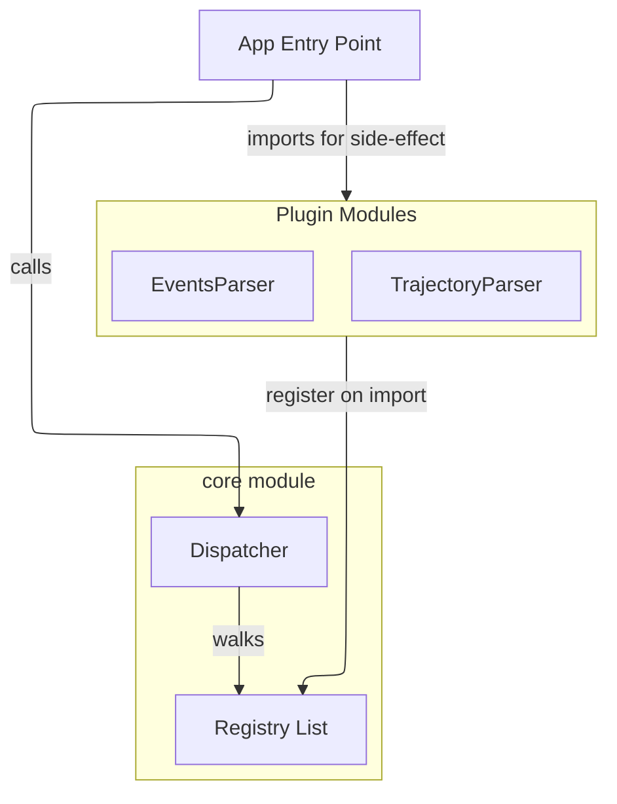

# The Registry Pattern — A Simple Tutorial

A registry is just a list (or dict) of handlers that somebody populates, and one dispatcher that walks the list to find the right handler for a given input. That's literally it. This post shows the smallest possible example, then builds up to the real-world version you'll see in plugin architectures everywhere.

---

## 1. The Pattern in 20 Lines

Imagine you write a tool that formats files. Different file types need different formatters. The naive approach hard-codes the choice:

```python
def format_file(path, content):
    if path.endswith(".py"):
        return format_python(content)
    elif path.endswith(".js"):
        return format_javascript(content)
    elif path.endswith(".json"):
        return format_json(content)
    else:
        raise ValueError(f"no formatter for {path}")
```

This works, but every time you add a new format you edit `format_file`. If `format_file` lives in a "core" module and `format_python` lives in a "python" plugin, core has to know about every plugin — the dependency arrow points the wrong way.

The registry version flips it:

```python
# core.py
_formatters = []  # the registry

def add_to_list(fn):
    _formatters.append(fn)
    return fn

def format_file(path, content):
    for fn in _formatters:
        result = fn(path, content)
        if result is not None:
            return result
    raise ValueError(f"no formatter for {path}")
```

```python
# python_plugin.py
from core import add_to_list

@add_to_list
def format_python(path, content):
    if not path.endswith(".py"):
        return None  # not mine, move on
    return "<<python-formatted>>\n" + content
```

```python
# app.py
import python_plugin  # ← this line is the magic
import core

print(core.format_file("foo.py", "x=1"))
```

Three things to notice:

1. **`_formatters` is a module-level list.** When `python_plugin` is imported, the `@add_to_list` decorator *runs* `_formatters.append(format_python)`. That's a side-effect of the import.
2. **`core.py` knows nothing about Python, JS, or JSON.** It only knows "there's a list of functions; ask each one." You can ship core without any plugins and it still loads (it just errors on every input).
3. **`import python_plugin` in `app.py` is load-bearing.** If you forget that line, `_formatters` stays empty and `format_file("foo.py", ...)` raises. This is why you sometimes see `import foo  # noqa: F401 — side-effect: register parser` comments — linters want to remove the "unused" import, but the import is the whole point.

That's the entire pattern. Everything else is decoration.

---

## 2. Two-Phase Dispatch: "Which One Handles This?"

In the toy example above, each formatter is called and checked for `None`. That's fine for simple cases. A slightly more structured version has each handler declare *what it can handle*, so dispatch is separate from execution:

```python
# core.py
_parsers = []

def register(cls):
    _parsers.append(cls)
    return cls

def parse(data):
    for cls in _parsers:
        if cls.can_handle(data):
            return cls().parse(data)
    raise ValueError("no parser for this data")
```

```python
# events_parser.py
from core import register

@register
class EventsParser:
    @classmethod
    def can_handle(cls, data):
        return "events" in data
    def parse(self, data):
        return [...]
```

```python
# trajectory_parser.py
from core import register

@register
class TrajectoryParser:
    @classmethod
    def can_handle(cls, data):
        return "trajectory" in data
    def parse(self, data):
        return [...]
```

Now the dispatcher calls the cheap `can_handle` check first and only instantiates/parses once it's found a match. This is a "two-phase" registry: declare capability, then do the work.

---

## 3. Applying It in Practice

Here's how the pattern maps to a real plugin system. Say you're building a data pipeline that needs to parse different file formats. The structural relationships look like this:




The key insight from this diagram: **the `core module` never imports `Plugin Modules`**. The only arrows into the core are from plugins and from the app — core itself points nowhere outward. That inverted dependency is what makes the pattern extensible.

| Concept | Implementation |
|---|---|
| `_parsers` list | A module-level `registry` list in your base package |
| `register(cls)` decorator | Appends the class to the registry at import time |
| `parse(data)` dispatcher | Loops the registry, asks each class `can_handle(data)` |
| `can_handle(data)` | A classmethod that checks keys, headers, or file extensions |
| `EventsParser`, `TrajectoryParser` | One class per format, each in its own module |
| `import events_parser` | The side-effect import that populates the registry |

The flow when you call the dispatcher:

1. Your entry point imports the plugin modules → each module's top-level code calls `register(MyParser)`. The registry list now has entries.
2. Your entry point calls `parse(raw_data)` — the dispatcher in the base module.
3. The dispatcher walks the registry: it asks each parser `can_handle({...})`.
4. First match wins — the dispatcher instantiates it and calls `.parse(data)`.

**The crucial property:** the base package never imports any plugin, but it still dispatches to the right parser because each plugin registered itself on import. When you add a new format, you write one new module that ends with `register(NewParser)`, and the only change in base is... nothing. That's what registries buy you: **extensibility without modifying the core**.

---

## 4. The Footgun to Know About

The whole system depends on the plugin being imported *before* you call the dispatcher. If you write:

```python
from core import parse
parse(some_data)  # ← kaboom: registry is empty
```

...you get a "no parser" error even though the parser exists, because nothing ever ran the registration line. That's why you'll see side-effect imports like:

```python
import my_plugin  # noqa: F401 — side-effect: registers MyParser
```

The `noqa: F401` tells the linter "yes, I know this import is unused by name — don't delete it." Without that comment, a cleanup pass could silently break dispatch by removing what looks like dead code.

### Where You'll See This in the Wild

This pattern shows up everywhere:

- **Django** — apps register models, admin classes, and signal handlers at import time via `AppConfig.ready()`
- **Flask** — blueprints and extensions register routes as side-effects
- **pytest** — plugins register hooks via entry points, loaded at startup
- **setuptools** — `entry_points` in `pyproject.toml` declare plugin classes that get discovered and imported

---

## TL;DR

- Registry = a list somebody appends to at import time.
- Dispatcher = a loop over that list.
- Side-effect imports are how the list gets populated.
- Benefit: add new handlers without touching the core dispatcher.
- Risk: forget the side-effect import → empty registry → silent-ish failure.
